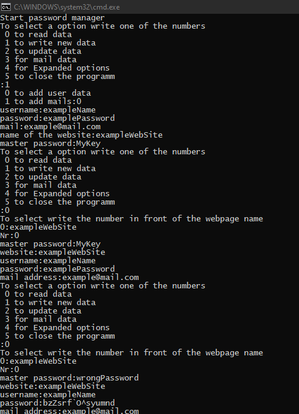

# Password-manager
<b>The program does not yet have a key extension. So don't use it.</b>
 
A console-based password manager							 
The program is written in such way that you could easy add more encryptions.		 
Everything is converted into a 16-bit character array that is easy to calculate with.	 

## Implement encryptions
- encodes each character with one decimal place of the sine
- each letter of the password is offset against the text.
